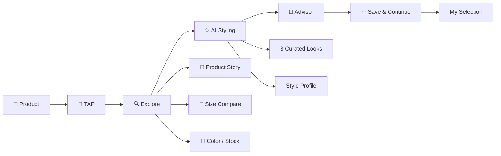
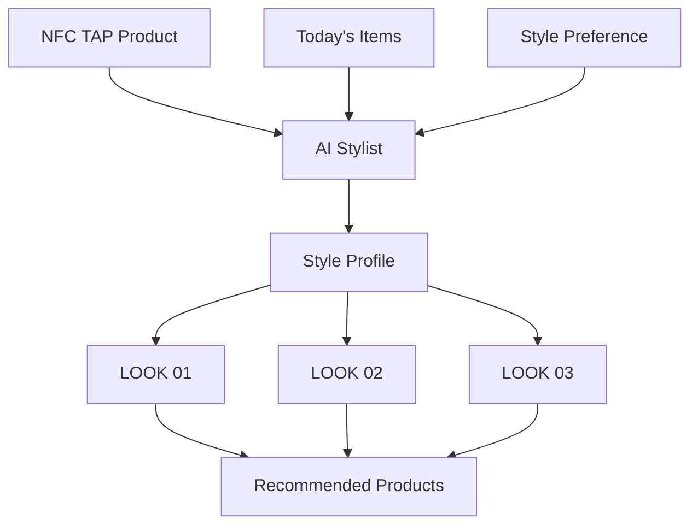
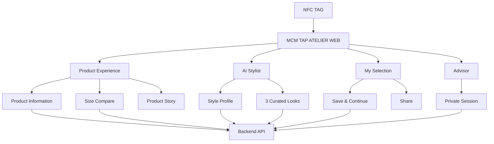
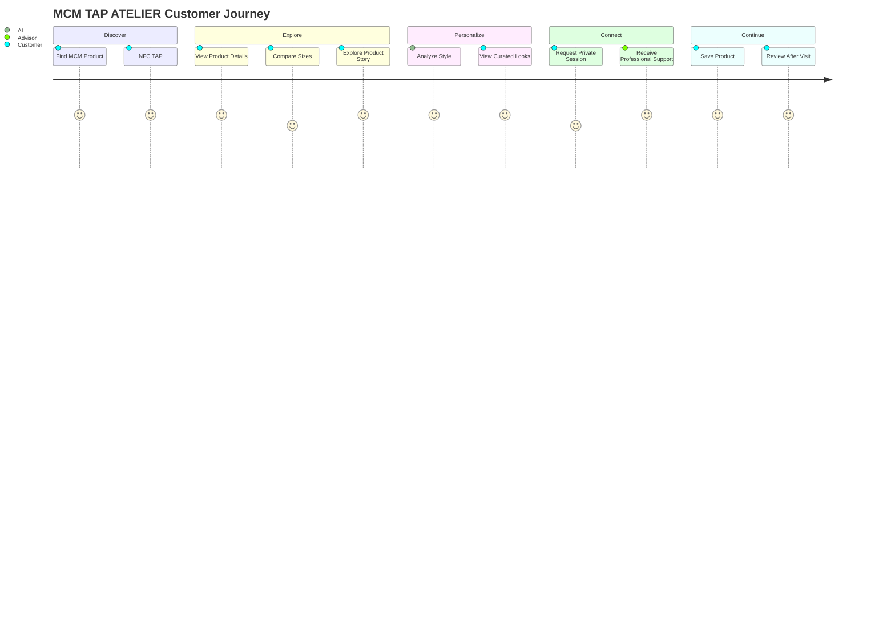
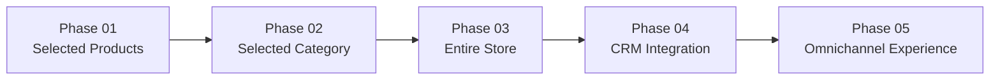

<div align="center">

<br />

# 🖤 MCM TAP ATELIER

### `TAP → EXPLORE → PERSONALIZE → CONNECT → CONTINUE`

**한 번의 TAP에서 시작되는 새로운 MCM 고객 경험**

NFC를 통해 매장의 실물 제품과 디지털 탐색,  
AI Styling, Advisor 상담, Save & Continue를 하나의 흐름으로 연결하는  
**Interactive Retail Service**

<br />

<a href="https://frontend-cntjdus1.vercel.app/product/1">
  
</a>

<br /><br />


<br />

</div>

---

## ✦ About MCM TAP ATELIER

> **온·오프라인에 흩어진 MCM 고객의 탐색 경험을  
> NFC 제품 TAP을 통해 하나의 흐름으로 연결합니다.**

MCM 고객은 매장에서 제품을 직접 보고 만지며  
**크기 · 소재 · 컬러 · 착용감**을 확인하고,

더 궁금한 정보가 있다면 온라인에서 검색하거나  
Advisor에게 질문하며 탐색을 이어갑니다.

하지만 현재의 경험에서는

```text
매장에서 본 제품
      ↓
온라인에서 찾은 정보
      ↓
직원과 나눈 상담
      ↓
구매 전 다시 확인하는 정보
```

각각의 경험이 서로 분리되어 있습니다.

**MCM TAP ATELIER**는 제품에 부착된 NFC를 시작점으로  
이렇게 흩어진 고객의 탐색 경험을 하나의 흐름으로 연결합니다.

---

## ✦ The Problem

<div align="center">

### 고객은 충분히 알아보고 싶은데,  
### 채널이 바뀔 때마다 탐색은 다시 시작됩니다.

</div>

<br />

| Before | Problem |
| :--- | :--- |
| 👜 **In Store** | 매장에서 확인한 제품 정보를 다시 찾아야 함 |
| 🔎 **Online Search** | 눈앞의 제품을 제품명부터 다시 검색해야 함 |
| 💬 **Advisor** | 어떤 제품을 봤고 무엇을 고민했는지 다시 설명해야 함 |
| 🤔 **After Visit** | 매장을 나온 뒤 탐색 결과가 자연스럽게 이어지지 않음 |
| ✨ **Styling** | 제품이 나에게 어떻게 어울릴지 직접 상상해야 함 |

<br />

TAP ATELIER는 새로운 채널을 하나 더 만드는 것이 아니라,

**MCM이 이미 제공하고 있는**

`Physical Product` · `Digital Information` · `Brand Story`  
`AI Styling` · `Advisor Service`

를 **하나의 제품을 중심으로 연결**합니다.

---

# ✦ Experience Flow

<div align="center">

### `01 TAP` → `02 EXPLORE` → `03 PERSONALIZE` → `04 CONNECT` → `05 CONTINUE`

</div>

<br />



---

# 01. TAP

### Tap the product. Start the experience.

매장에서 관심 있는 MCM 제품에 스마트폰을 TAP하면  
별도의 앱 설치나 제품명 검색 없이  
**현재 보고 있는 제품의 모바일 웹으로 바로 연결됩니다.**

```text
MCM Product
     ↓
  NFC TAP
     ↓
Product ID
     ↓
Digital Product Experience
```

제품별 NFC Tag와 고유 Product ID를 연결해  
**실물 제품 → 디지털 경험**의 진입 과정을 최소화합니다.

---

# 02. EXPLORE

### More than product information.

제품을 다시 검색할 필요 없이  
현재 눈앞에 있는 제품을 기준으로 필요한 정보를 탐색합니다.

### Product Information

- 제품명 / 가격
- 컬러
- 소재
- 사이즈
- 재고
- 관리 방법
- Dimensions / Weight
- Strap / Storage

### Compare Sizes

제품 특성에 따라 사이즈별 차이를 한눈에 비교합니다.

```text
Size
│
├── Dimensions
├── Weight
├── Storage
├── Price
└── Stock
```

### Product Story

단순한 스펙을 넘어 제품에 담긴 MCM의 이야기를 전달합니다.

`COLLECTION`

`DESIGN`

`SILHOUETTE`

`MATERIALS`

`CRAFTSMANSHIP`

`HERITAGE`

고객은 제품의 가격과 기능뿐 아니라  
**왜 이런 디자인이 만들어졌는지**,  
**어떤 브랜드 가치가 담겨 있는지**까지 탐색할 수 있습니다.

---

# 03. PERSONALIZE

<div align="center">

## ✦ AI STYLIST

### From Product to *Your Style.*

</div>

제품에 대한 이해를  
고객 개인의 취향과 스타일 맥락으로 확장합니다.

TAP한 제품과 최근 관심 스타일을 기반으로  
AI가 고객에게 맞는 **3가지 Curated Look**을 제안합니다.



### AI Style Profile

고객의 최근 탐색을 바탕으로

- Based on Today's Items
- Style Keywords
- Styling Preference
- Curated Look

을 분석합니다.

### 3 Curated Looks

AI는 단순히 비슷한 제품을 나열하지 않습니다.

**"이 제품이 나에게 어떻게 어울릴까?"**

라는 질문에 답할 수 있도록

- 스타일 컨셉
- 추천 제품
- 스타일링 이유
- 활용 방법

을 함께 제공합니다.

---

# 04. CONNECT

<div align="center">

## ✦ PRIVATE SESSION

### Digital exploration meets human expertise.

</div>

AI와 디지털 경험이 Advisor를 대신하지 않습니다.

오히려 고객이 충분히 스스로 탐색한 뒤  
**사람의 전문적인 도움이 필요한 순간 자연스럽게 연결**합니다.

예를 들어,

- 현재 매장 재고가 궁금할 때
- 다른 컬러를 보고 싶을 때
- 다른 사이즈를 직접 착용하고 싶을 때
- 제품에 대해 더 전문적인 설명을 듣고 싶을 때

Private Session을 통해  
관심 제품과 요청 내용을 Advisor에게 전달합니다.

```text
Customer Exploration
        ↓
 Interested Product
        ↓
 Customer Request
        ↓
 Private Session
        ↓
     Advisor
        ↓
Personalized Consultation
```

고객이 무엇을 보고 있었는지 다시 처음부터 설명하지 않아도  
**앞선 탐색 맥락을 기반으로 상담을 이어갈 수 있는 경험**을 지향합니다.

---

# 05. CONTINUE

<div align="center">

## ♡ SAVE & CONTINUE

### The experience doesn't end when you leave the store.

</div>

구매를 바로 결정하지 않아도 괜찮습니다.

고객은 탐색 중 관심 있었던 제품과  
AI Styling 결과를 **My Selection**에 저장할 수 있습니다.

매장을 나온 뒤에도

- 관심 제품 다시 보기
- 제품 상세 정보 확인
- AI Styling 결과 확인
- Saved Product 관리
- 결과 공유

등을 통해 고민을 이어갈 수 있습니다.

```text
IN STORE
   │
   ├─ TAP
   ├─ EXPLORE
   ├─ AI STYLE
   └─ SAVE
       │
       ▼
OUT OF STORE
   │
   ├─ REVIEW
   ├─ COMPARE
   ├─ SHARE
   └─ CONTINUE
```

---

# ✦ Core Features

| Feature | Description |
| --- | --- |
| 📱 **NFC Product TAP** | 제품별 NFC Tag를 통해 해당 제품 페이지로 즉시 이동 |
| 👜 **Product Detail** | 가격, 소재, 컬러, 사이즈, 재고 등 제품 정보 탐색 |
| 📐 **Compare Sizes** | 제품별 크기·무게·수납·가격·재고 비교 |
| 📖 **Product Story** | Collection, Material, Craftsmanship, Heritage 등 브랜드 스토리 |
| ✨ **AI Style Profile** | 고객이 탐색한 제품을 바탕으로 스타일 특성 분석 |
| 👗 **AI Curated Looks** | 개인화된 3가지 Styling Look 제공 |
| 💬 **Private Session** | 필요한 순간 Advisor 상담으로 연결 |
| ♡ **My Selection** | 관심 제품 저장 및 저장 취소 |
| 🔄 **Save & Continue** | 매장에서 시작한 탐색을 이후에도 이어서 확인 |
| 🔗 **Share Result** | 링크 복사 및 결과 공유 기능 |
| 💛 **Kakao Share** | KakaoTalk을 통한 결과 공유 |

---

# ✦ Service Architecture



---

# ✦ Frontend Architecture

```text
MCM TAP ATELIER
│
├── NFC Entry
│   └── Product Page
│
├── Product Experience
│   ├── Product Detail
│   ├── Product Information
│   ├── Compare Sizes
│   └── Product Story
│
├── AI Stylist
│   ├── AI Style Profile
│   ├── Today's Items
│   ├── Style Keywords
│   ├── Curated Look 01
│   ├── Curated Look 02
│   └── Curated Look 03
│
├── Advisor
│   └── Private Session
│
└── My
    ├── Saved Products
    ├── Saved Product Detail
    ├── Share Result
    └── Save & Continue
```

---

# ✦ Tech Stack

## Frontend

<div>


</div>

### UI / Interaction

<div>


</div>

### Deployment

<div>


</div>

### External

<div>


</div>

---

# ✦ User Journey



---

# ✦ Why NFC?

### Search less. Explore more.

기존에는 매장에서 제품을 본 뒤  
제품명을 기억하거나 다시 검색해야 했습니다.

TAP ATELIER에서는

```diff
- 제품명 확인
- 검색창 열기
- 제품 검색
- 동일 제품 찾기

+ 스마트폰으로 TAP
```

단 한 번의 행동으로  
**현재 보고 있는 제품에서 디지털 탐색이 시작됩니다.**

NFC는 새로운 쇼핑 행동을 강요하는 장치가 아니라,  
고객이 이미 하고 있던 탐색을 **더 자연스럽게 연결하는 인터페이스**입니다.

---

# ✦ Design Direction

TAP ATELIER는 MCM의 럭셔리한 브랜드 경험을  
디지털에서도 유지할 수 있도록 설계했습니다.

### Keywords

```text
LUXURY
EDITORIAL
MINIMAL
IMMERSIVE
PERSONALIZED
INTERACTIVE
SEAMLESS
```

### UX Principles

**01 — Product First**  
모든 경험은 고객이 실제로 보고 있는 제품에서 시작합니다.

**02 — Less Friction**  
검색이나 앱 설치 없이 한 번의 TAP으로 접근합니다.

**03 — Explore at Your Own Pace**  
직원 호출을 강요하지 않고 고객이 충분히 직접 탐색할 수 있게 합니다.

**04 — Human When Needed**  
전문적인 도움이 필요한 순간에는 Advisor와 연결합니다.

**05 — Continue Beyond the Store**  
매장을 나온 뒤에도 고객의 고민과 관심이 이어집니다.

---

# ✦ Business Value

TAP ATELIER는 고객 경험 개선뿐 아니라  
고객이 제품을 탐색하는 과정을 이해할 수 있는 기반이 됩니다.

향후 고객 동의를 전제로 다음과 같은 행동 데이터를 활용할 수 있습니다.

```text
NFC TAP
   ↓
Product Detail View
   ↓
Product Story
   ↓
AI Styling
   ↓
Save
   ↓
Advisor Request
```

이를 통해

- 어떤 제품에서 고객 관심이 높은지
- 어떤 정보까지 탐색하는지
- 어떤 제품이 저장으로 이어지는지
- AI Styling이 실제 탐색에 어떤 영향을 주는지
- 어떤 상황에서 Advisor 연결이 발생하는지

등을 확인할 수 있습니다.

이는 향후

**CRM Personalization**  
**Advisor Experience**  
**Product Recommendation**  
**Retail Experience Optimization**

으로 확장될 수 있습니다.

---

# ✦ Expansion Strategy



### Phase 01
일부 제품을 대상으로 NFC TAP 경험 검증

### Phase 02
제품군 단위로 적용 범위 확대

### Phase 03
매장 내 전체 제품으로 확장

### Phase 04
제품 · 재고 · 고객 데이터 시스템 연계

### Phase 05
오프라인 매장에서 시작한 고객 경험을  
MCM의 전체 디지털 채널로 확장

---

# ✦ Getting Started

### 1. Repository Clone

```bash
git clone <repository-url>
```

### 2. Move to Project

```bash
cd <project-directory>
```

### 3. Install Dependencies

```bash
npm install
```

### 4. Environment Variables

프로젝트 루트에 `.env` 파일을 생성합니다.

```env
VITE_API_BASE_URL=<YOUR_API_BASE_URL>
VITE_KAKAO_JAVASCRIPT_KEY=<YOUR_KAKAO_JAVASCRIPT_KEY>
```

> `.env` 파일과 실제 API Key는 GitHub Repository에 업로드하지 않습니다.

### 5. Run

```bash
npm run dev
```

### 6. Build

```bash
npm run build
```

---

# ✦ Deployment

<div align="center">

<br />

### Experience MCM TAP ATELIER

<br />

<a href="https://frontend-cntjdus1.vercel.app/product/1">
  
</a>

<br /><br />

### [🔗 MCM TAP ATELIER 바로가기](https://frontend-cntjdus1.vercel.app/product/1)

<br />

`https://frontend-cntjdus1.vercel.app/product/1`

</div>

---

# ✦ Our Vision

<div align="center">

<br />

### **From a Product to an Experience.**
### **From a TAP to a Relationship.**

<br />

MCM TAP ATELIER는  
새로운 디지털 채널을 하나 더 만드는 서비스가 아닙니다.

고객이 매장에서 만난 **하나의 제품**을 중심으로

**Physical Experience**  
↓  
**Digital Exploration**  
↓  
**AI Personalization**  
↓  
**Human Expertise**  
↓  
**Continuous Relationship**

을 연결합니다.

<br />

### **One Product. One TAP. One Connected Experience.**

<br />

# `MCM TAP ATELIER`

#### *A New Interactive Retail Experience by MCM*

<br />

---

<sub>
This project proposes an interactive retail experience that connects physical products,
digital exploration, AI-powered styling, and professional advisor services through NFC.
</sub>

</div>
